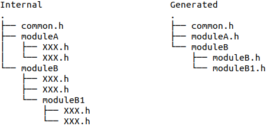

# AutoC
A lightweight python module, reduce the times of manual modification in C/C++ programming.  
* Any Linux distros.  
* Does not tested on Windows.  
## Classes

| Name | Description |  
| ------ | ------ |  
| header | Trim/expand/combine the internal C/C++ headers to generate outer API header files |  
## Header
### Directory Structure
To utilize it, you need to organize the header files' directory structure with the following rules:  
* Header and source files are separately stored under a different directory.  
* Each directory represents a module, the directory's name means the module's name.  
* Directories under a directory represent the submodules.  
* Header files at depth 0 under the directory will be combined into a single header named 'ModuleName.h', submodules with being processed by the same procedure.  
* Example:  
	
### Basic Parameter
The initialization of class 'header' requires three parameters:  

| Parameter | Description |  
| ------ | ------ |  
| project_name | The project's name |  
| inner_dir | The root direction of internal header files. |  
| outer_dir | The path of the output, new folder(s) will be created if the path not exists. |  
### Trim modes
Trim lines of text in headers.  

| No. | Mode | Range | Method | Parameter |  
| ------ | ------ | ------ | ------ | ------ |  
| 0 | paragraph | between start and end token | add_paragraph_patterns(tokens) | **token**: [\['start_token1', 'end_token1'], ...] |  
| 1 | regex | match the regexs | add_regex_patterns(re) | **re**: [regex1, regex2, ...]  
| 2 | leading | leading with specific charater | add_leading_patterns(leading) | **leading**: ['a', 'b', ...] |  
| 3 | contained | contained specific words or charaters  | add_contained_patterns(contained) | **contained**: ['word1', 'word2', ...] |  
| 4 | whole | equals the entire line of text | add_whole_patterns(whole) | **whole**: ['sentence1', 'sentence2', ...] |  
### Expand modes
Add lines of text to headers.  

| No. | Mode | Effect | Method | Parameter |  
| ------ | ------ | ------ | ------ | ------ |  
| 5 | top constant | add lines at the top of the header | add_top_constants(constant_lines) | **constant_lines**: ['line1', 'line2', ...] |  
| 6 | bottom constant | add lines at the bottom of the header | add_bottom_constants(constant_lines) | **constant_lines**: ['line1', 'line2', ...] |  
| 7 | include dependency | Add '#include <depended.h>' in module.h | add_include_dependency(pairs) | **pairs**: {'module': ['depend1', 'depend2', ...], ...} |  
| 8 | quote | Add paired lines at the top and at the bottom of the header | add_quotes(quotes) | **quote**: [\['top_line1', 'bottom_line1'], ...]  
### Generate

| Method | Parameter |  
| ------ | ------ |  
| generate(mode_order) | **mode_order**: '012345678' |  
### Example
Create a new python file and type codes like this and execute it.  
> import AutoC  
> m = AutoC.header('project', '/home/user/project/include/internal', '/home/user/project/include/outer')  
> m.add_paragraph_patterns([['// BEGIN\n', '// END\n']])  
> m.add_regex_patterns([r'^#\w+'])  
> m.add_leading_patterns(['/', '*'])  
> m.add_contained_patterns(['test'])  
> m.add_whole_patterns(['#include "common.h\n"'])  
> m.add_top_constants(['#ifndef XXX\n', '#define XXX\n'])  
> m.add_bottom_constants(['#endif\n'])  
> m.add_include_dependency({'moduleA': ['common'], 'moduleC': ['moduleA', 'moduleB']})  
> m.add_quotes([['extern "C" {\n', '}\n']])  
> m.generate('012345678')